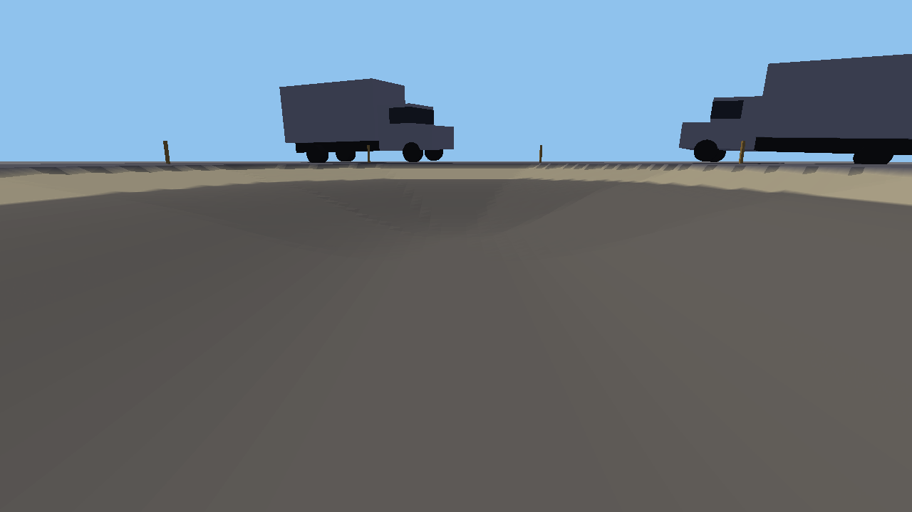
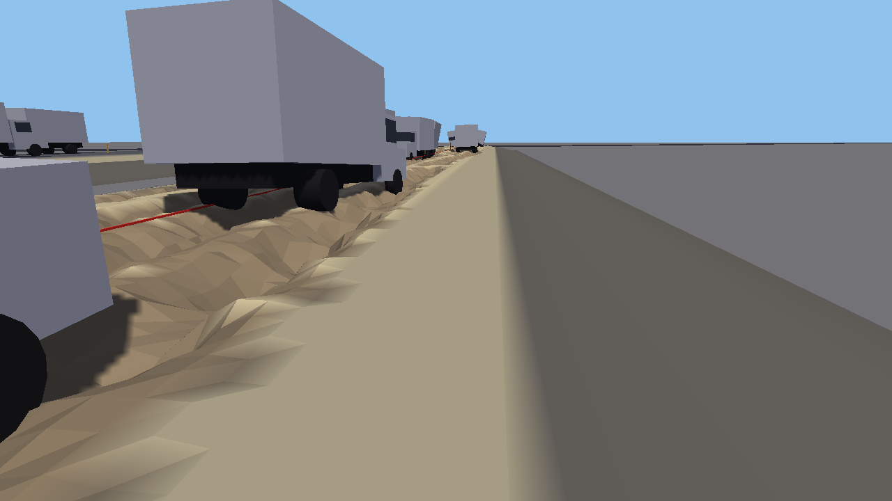
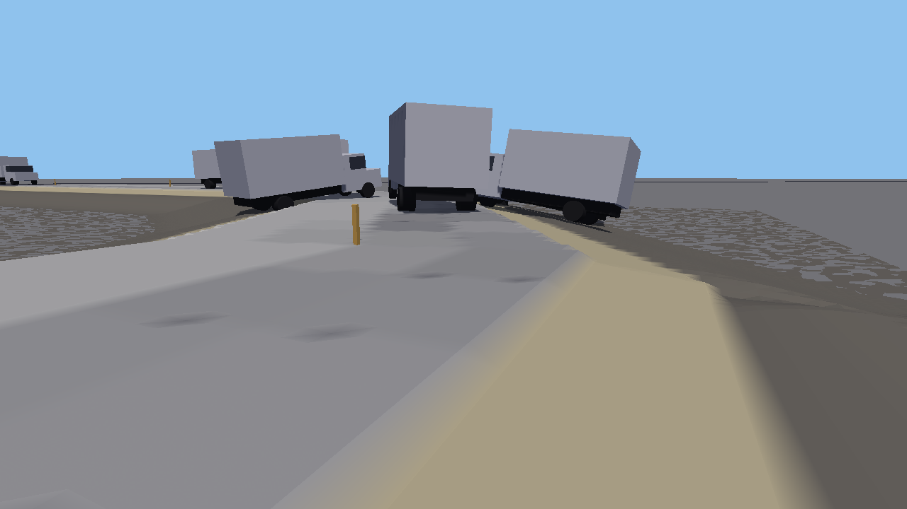
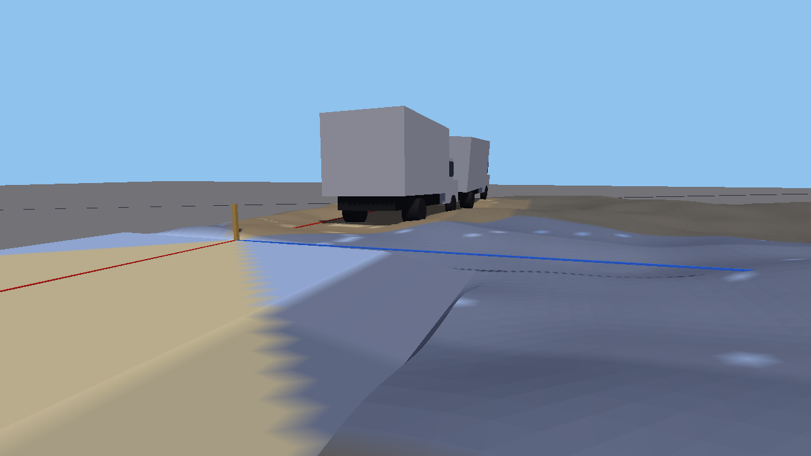
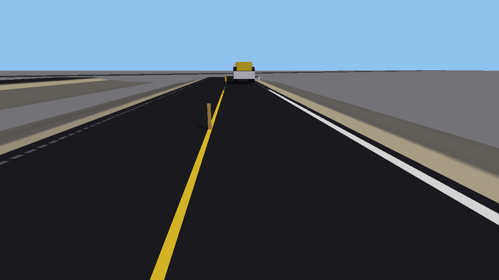
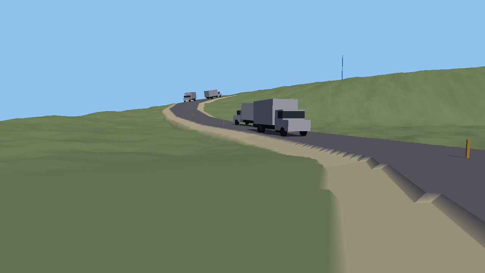

# Session of 2026-10-06: the six slices

One unattended build, from about 00:00 to 02:00, written up by Claude. Six commits, none pushed.
All six slices are built, each was checked on two instances, and the Windows player is built
from the last commit. **None of it has been played by you**, bar about five minutes at 01:05.

## Added the same morning, to your requests

After you had tried the slices you asked for ten things. All are built, checked on two
instances and in the Windows player; none has been played. Your words and what was built are in
`DESIGN.md` under "What the user asked for after first playing them". In short:

- **Gravity starts at the Moon.** It is the engine's own gravity, plus the blob's fall, plus my
  two switches for wheels and springs.
- **Driving is third person**; C switches to the seat.
- **The pick-up seats four**: E gets in, 1 to 4 change seat.
- **The paint truck takes a driver and one or two in the bed**, who have the nozzles.
- **A second spin-out road**: low ground, three paved sections, loose gravel, a bend. It is to
  the right of where you start on New > Spin-out. It is about twice as dangerous as the first.
- **The Wear ground is 10 m up and has four roads**, with a count of trucks on signs over each.
- **Signs are as tall as their text.**

Checked by script: each road's trucks and counts; host and client ground the same on all four
wear roads and both spin-out roads; a client put into the pick-up's seats and moved between
them, riding with the truck; the paint truck with a driver and an operator, the driver refused
the nozzles and the operator given both. **Not checked**: the seat keys and C pressed on a
keyboard (the host was asked directly); how the signs read on screen, since my screenshots do
not show them; two operators at once; the pace of wear at the Moon beyond the 250 trucks run
earlier. Choices of mine in this: the C key and 9 m; 1 to 4 for seats; standing in the bed
as the pick-up's back seats; the driver losing the nozzles while anyone is in the bed; the
second spin-out road being the same from both ends; each wear road being a plot of its own, so
the high ground is four strips that meet; `wearDeepest` left at 0.8 m.

The play list below is as it was written before these, so where it says Mars, read the Moon,
and where it says two wear roads, read four.

## Play list

Host from the editor or the player. The host's bar at the top of the screen has three rows of
grounds: **Tests**, **New** (tonight's) and **Maps**. Under them: **Gravity** (Earth, Mars,
Moon; it starts at Mars) and **Speed** (x1, x4, x10). F3 is the readout, F1 the sliders.

### 1. Gravity. How low is fun?

- **Where**: anywhere. Start on **Tests > Trucks**, which you know: the finished hairpin, the
  bad road, the ramps. Then drive something on **Tests > Driving**.
- **Keys**: the three Gravity buttons, or `planetGravity` on F1. Space to hop.
- **Look for**: trucks in the hairpin at Mars and at the Moon. They get round, but 3 m and 7 m
  out of their lane. The blob's hop is 1.6 m at Mars and 3.9 m at the Moon.
- **Two switches of mine on F1, under "Planet"**, both on. `gripFollowsGravity` off makes wheels
  bite as on Earth, and every climb easy. `springsFollowGravity` off gives Earth's stiff springs:
  vehicles ride high and are thrown about more.

### 2. Wear. Does a road fall apart at that pace, and is it good to watch?

- **Where**: **New > Wear**. A dirt road nearest you and a packed gravel road beyond it, a truck
  from each end every 4 seconds.
- **Keys**: none needed. F3 counts the trucks on the road you are nearest and measures its ruts.
  Speed x10 gets to 500 trucks in about three minutes. 2 and 3 mend a road. V flies.
- **Sliders**, F1 under "Wear": `wearByLanding` is the one between damage by time (0) and by how
  hard a truck lands (1). `wearDirt`, `wearGravel`, `wearScaleUp`, `wearCut`, `wearDeepest`.
- **The pace it came out at** is in the table below.

### 3. Spin-out. Is loose gravel dangerous for long enough to matter?

- **Where**: **New > Spin-out**. Loose gravel round a 90 degree bend, the same traffic.
- **Keys**: "Loosen the gravel again" on the host's bar starts it over. F3 counts spins.
- **Sliders**, F1 under "Loose gravel": `looseGrip`, `looseFishtail`, `spinAngle`,
  `spinSeconds`. And `truckPacking`, under "Claude's additions": 0.02 now, 0 stops trucks
  packing, 0.25 is what it was.

### 4. Gravel delivery. Is bringing gravel over a road I built a job worth doing?

- **Where**: **Tests > Quarry**.
- **What to do**:
  1. Stake some road. Press 1, click the end stake of the bare road, and carry the road on by
     two stakes. The drop-off has to branch from a stake in the middle of a road, because the
     truck drives past it and backs in, and to start with there is none free.
  2. Press 9. Left click the stake that used to be the end. Left click the ground beside the
     road, 7 to 20 m away. That is the drop-off: a stake with an orange board, on a blue spur.
  3. Go down into the pit and load the truck as before: 3, click the rock, click the truck.
     When it has 12 it leaves by itself. A right click sends it sooner.
  4. It drives up, past the junction, and backs into the spur. Unload it as before: 3, click the
     truck, say where the heap goes, then a click on the truck and a click on the heap. Each
     shovel is now worth ten squares of gravel. When it is empty it drives home.
- **Travellers** drive the road for everyone the whole time. Stand at the junction when the
  truck arrives and watch what happens to the ones behind it. I did not: see "Not checked".
- **Sliders**, F1 under "Quarry": `shovelWorth`, `haulPass`, `haulBackSpeed`, `haulRespawn`,
  and `quarryWear`, which is off.

### 5. Painting by hand. Is drawing a line by hand hard in a good way?

- **Where**: **New > Painting**. The near strip has the lines' places marked. The far one does not.
- **Keys**: 8 is the roller brush: hold left click and drag for white, right click for yellow.
  T is the tar spray and G the grinder: hold left click. E by the paint truck gets in: W S A D
  drive, left click is the white nozzle on its right, right click the yellow one on its left.
- **The score is on F3 only**: the strip's, and the square's under your brush.
- **Sliders**, F1 under "Painting by hand": `paintBand`, `rollerWidth`, `centreBroken`,
  `sprayWidth`, `tarWidth`, `grinderWidth`.

### 6. The Long and Climb maps. Is a long road worth having?

- **Where**: **Maps > Long**, then **Maps > Climb**. Press **"Stake and finish this road"** on
  the host's bar. It works on every map.
- **Keys**: "Wear on maps" beside it is the switch; it is on. Speed x4 or x10. V flies.
- **Look for**: with wear on, the Long road carried 150 trucks without a wreck and had lost
  most of them by the 350th.

## What was built

| Slice | Commit | In one line |
|---|---|---|
| 1 Gravity | `894e76e` | One slider for trucks, driven vehicles and blobs, starting at Mars |
| 2 Wear | `894e76e` | A Wear ground; damage by time and by landing; scaling up; no wear on paved; a switch for maps |
| 3 Spin-out | `4dd51e3` | A Spin-out ground; sideways grip that depends on the surface; a spin when a truck is sideways enough |
| 4 Delivery | `afad3b4` | A survey tool for the drop-off; a truck that runs its own round and backs in |
| 5 Painting | `cc22428` | A Painting ground; paint in 0.1 m cells; roller brush, paint truck, tar, grinder; judging on F3 |
| 6 Maps | `6e7b8f8` | A button that stakes and finishes the road on any map |

Slices 1 and 2 share a commit: their code is in the same functions, and I checked them together.

## What you asked to be told

**Gravity, measured again** (both of my switches on; ten or more trucks to a figure; ramps 16 m
high). The full table is in `DESIGN.md`.

| | Earth | Mars | Moon |
|---|---|---|---|
| Packed gravel: every truck climbs | 27 degrees | 27 | 27 |
| Loose gravel: every truck climbs | 16 | 16 | 15 |
| Bare ground: every truck climbs | 10 | 12 | 12 |
| How far up 20 degrees of bare ground a truck coasts | 10 m | 27 m | 33 m |
| The tightest turn | all round, 0.8 m off the lane | all round, 2.9 m off | all round, 7.0 m off |

- **The tightest turn**: every truck gets round it at every gravity. They do not stay on the
  road doing it. At Mars a truck is half off the outside edge; at the Moon it leaves the road and
  the shoulder and drives back on. I changed nothing.
- **The 15 degree slope limit**: it still works as it was meant to. Every truck climbed 15
  degrees of loose gravel at all three gravities. What is different is that at the Moon most
  trucks (12 of 17) also climb 15 degrees of bare ground if it is only 16 m high, on the speed
  they arrive with. I changed nothing.

**The pace of wear**, at Mars, in trucks set off:

| Trucks | Dirt | Gravel |
|---|---|---|
| 5 | a square's worth cut, 8 cm deep | nothing |
| 50 | three quarters of the road cut, half of it deeper than 15 cm: a rut | 4 % of squares worn through and loose; no holes |
| 250 | all of it | over half the road cut, holes to 80 cm; 16 to 23 trucks wrecked so far |
| 500 | | 95 % cut; three trucks in four wrecked since the 350th |

You asked for a square destroyed on dirt by the fifth and a rut by the fiftieth: that is what it
does. For gravel you asked for several squares damaged by 50, several very deep holes by 250 and
unusable by 500: the second and third are met, and the first is weak (loose patches, not holes).
One thing is not what you described: **a dirt road worn right out is still driveable**. Trucks
drive the rut.

## What was checked, and how

| What | How |
|---|---|
| Nothing played has changed at Earth gravity | The climbs at Earth came out at the figures measured on 2026-10-05: 27, 16 and 10 degrees |
| Gravity | Script: 23 batches of trucks on ramps made to order, at Earth, Mars and the Moon |
| Wear | Script, to 500 trucks at Mars and 250 at Earth and the Moon, and at both ends of the time-or-landing slider. Two instances: both roads' ground the same on host and client after 44 trucks |
| Spin-out | Script: 60 or more trucks at each gravity. Two instances: the ground the same on host and client, before and after "Loosen the gravel again" |
| Delivery | Two instances: a client put the drop-off down and loaded the truck over the network; the truck drove out, backed in and stood; host and client agreed on the ground, the stakes, the truck and the heap. Then on the host, with simulated mouse clicks: the truck under the crosshair with each of seven tools in hand; the heap placed, a shovel taken off the truck and flung on the heap; the survey tool refusing an end stake, and refusing while the truck was out |
| Painting | Host, simulated mouse: a dragged stripe with the brush, both colors; tar over it; the grinder; the readout's score after each. The paint truck driven by script with both nozzles on. Two instances: a client that joined after the paint was down had the same cells, and a client's own strokes reached the host |
| Maps | The button on all five maps, with what it staked checked against the rope rules. 50 trucks on four maps with wear off, 350 on Long and Climb with it on. Two instances: a client present when the button was pressed, and one that joined after, both with the same ground |
| Screenshots | One of each slice from the blob's eyes, looked at |

## What was not checked

- **Nobody has held the mouse.** Every control check was a scripted click. How any of it feels
  is unknown.
- **Travellers behind the truck as it backs in**: I did not watch it. On the first run the
  gravel truck was wrecked near the junction and I did not find out by what.
- **The paint truck from the driver's seat**: its nozzles were switched by calling the host,
  not by clicks from inside it. Getting in with E was not scripted either.
- **A client using the brush, tar or grinder by hand**: the client painted by script.
- **Driven vehicles in low gravity**: the code is the trucks' code, but nothing drove one.
- **The blob's hop**: worked out, not jumped.
- Wear on the Quarry ground (`quarryWear`), which is off.
- The Middle map at lengths other than 150 m with the button.
- Three or more players.

## What went wrong

- **You were in the editor at 01:05 and I had just left two compile errors on disk.** Slice 5's
  patch gave `Plot` two names it already had. You were in play mode, so the errors did nothing to
  your game, but if you had stopped, the editor would not have played again. I left the scripts
  alone until you stopped, about five minutes, and wrote docs meanwhile; then fixed it. My compile
  script now refuses if the editor is in play mode. I do not know whether you saw any of it.
- **The first Moon measurements were wrong.** Ramps tall enough for the Moon were longer than
  the yard, trucks from the far end fell off the world, and the batch counted them. Redone on
  ramps that fit.
- **The first wear settings dug both roads down to the yard**, 1.2 m, inside 100 trucks. Holes
  now have a deepest, and an uneven bottom.
- **Loose gravel spun trucks at Mars and never on Earth**, until its grip stopped following
  gravity.
- **The button's first roads on Climb and Switchback broke the bend rule** (67 and 69 degrees),
  and then sent every truck into town B's houses by arriving at an angle. Rerouted twice.
- **Every truck arriving at town A blew up at my feet.** A blob at the starting spot stands in
  their lane, and trucks do not pass through blobs. This has been so since the maps were built.
- My screenshots looked as if the eye were at knee height for half the night. It was the field
  of view, not the eye.
- I committed `docs/answers/1.md` with the first commit of the night, by adding the whole of
  `docs`. It is your file. I have left `docs/answers/image.png` alone.

## Every choice that was mine

Each can be switched off or set back. Say yes or no.

| # | Choice | Why | To undo |
|---|---|---|---|
| 1 | Wheels push, brake and hold sideways in proportion to gravity | Without it a truck at Mars climbs 25 to 30 degrees of bare ground and gravel means nothing | `gripFollowsGravity` 0 |
| 2 | Springs as soft as the gravity | Earth's springs make vehicles ride 15 to 20 cm high | `springsFollowGravity` 0 |
| 3 | Gravity buttons on the host's bar | One click to compare planets | Use the slider |
| 4 | Fast forward, x1 to x10, a slider and three buttons | 500 trucks is half an hour at x1 | `fastForward` 1 |
| 5 | The wear roads are 100 m, with a truck every 4 s from each end | "Steady traffic", and 500 trucks in a sitting | `wearTruckEvery` |
| 6 | Damage by time and by landing split evenly | A starting point between your rule and my proposal | `wearByLanding` |
| 7 | Holes have a deepest, 0.8 m, with an uneven bottom | Without it roads were dug to the yard | `wearDeepest` |
| 8 | Bare ground is cut 6 times as deep as gravel each time | Dirt reached the threshold fast but then rutted slowly | `wearDirtCut` |
| 9 | The first wear road, on the Trucks ground, keeps its old rule | You played it | It is in the code, not on a slider |
| 10 | Wear is on for maps and off for the Quarry ground | So the delivery slice asks one question | `mapWear`, `quarryWear` |
| 11 | A spin-out is a state: past 22 degrees sideways, wheels locked for 2.5 s | Low grip alone made trucks slide wide and carry on; nothing was dangerous | `looseFishtail` 0, `looseGrip` 1 |
| 12 | Loose gravel's grip is the same on every planet | Otherwise it never spun a truck on Earth | It is in the code |
| 13 | Loose gravel spins trucks everywhere, including the Trucks ground's two gravel ramps and maps | The hazard belongs to the surface, not to one ground | As 11 |
| 14 | Trucks pack gravel at 0.02 a time, down from 0.25, on maps too | Your instruction: a setting where loose gravel stays dangerous for more than one truck | `truckPacking` 0.25 |
| 15 | The drop-off is a stake on a spur, branching from a stake in the middle of a road | It makes "joined by road" literal, and gives the truck road to drive past and back in from | A redesign |
| 16 | The spur is a service road | So travellers do not drive into the drop-off | The zoning tool, 4 |
| 17 | The truck leaves by itself when full and when empty; a right click sends it sooner | "Runs its own round" | It is in the code |
| 18 | At the quarry the truck is turned round on the spot | Nowhere in the pit to turn. As before | A turning place |
| 19 | One "load" is one shovel: 30 clicks, ten squares | My reading of "1 load -> 10 tiles" | `shovelWorth` |
| 20 | An empty truck comes 20 s after a wreck | You asked for a delay | `haulRespawn` |
| 21 | Travellers at the quarry start 4 m beyond a road's end, not 14 | A road staked toward the edge of the high ground had them starting on the slope and rolling over | It is in the code |
| 22 | The paint truck has a nozzle each side, on a button each | Two lines to a pass, and a broken line made by clicking | A redesign |
| 23 | The judging counts length of line covered, not area of band filled | A 0.15 m roller cannot fill a 0.4 m band | A redesign |
| 24 | The band is 0.4 m, the roller 0.15 m, the centre line broken | Starting values | `paintBand`, `rollerWidth`, `centreBroken` |
| 25 | Tar and the grinder are on T and G | The number keys are full | Rebind |
| 26 | The marks are a faint dotted line down the middle of each band | The least that says "here" | A redesign |
| 27 | The button finishes a road to packed gravel, not asphalt | Paved road does not wear, and you wanted to watch wear | The dev tool, 7, paves a section |
| 28 | The button works on all five maps | It cost nothing more | Do not press it |
| 29 | Players on a map start 3.5 m further left | A blob at the old spot blew up every arriving truck | One number in `Plot.SpawnAt` |
| 30 | A new row of buttons, "New", for tonight's grounds | So they can be found | Move them |
| 31 | The lorry snapshot carries only the chosen ground's trucks | More trucks would not fit in one unreliable message | None needed |
| 32 | The quarry's help label now shows | It was being overwritten by the truck's label | None needed |

Not built, by your list: money, a large map, signage, hot asphalt, vehicle health, driver
recklessness, vehicles hitting players, repaving over paint, wear on paved road, theming, NPC
workers.
